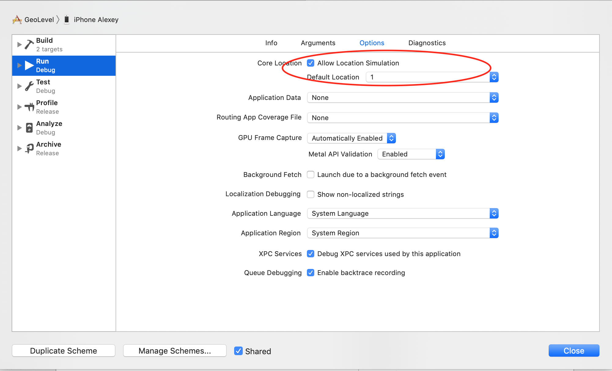

# geolevel

Demo todo
1. Add real data.
    1. Replace content of 1.gpx or
    1. Add new file to the project. And add the file name to SettingsViewController.bundledFiles
1. Remove location simulation before building for real demo if personal team is used.

